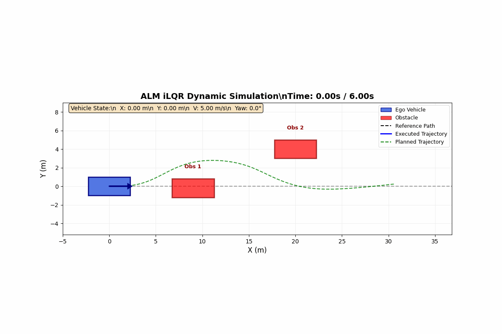
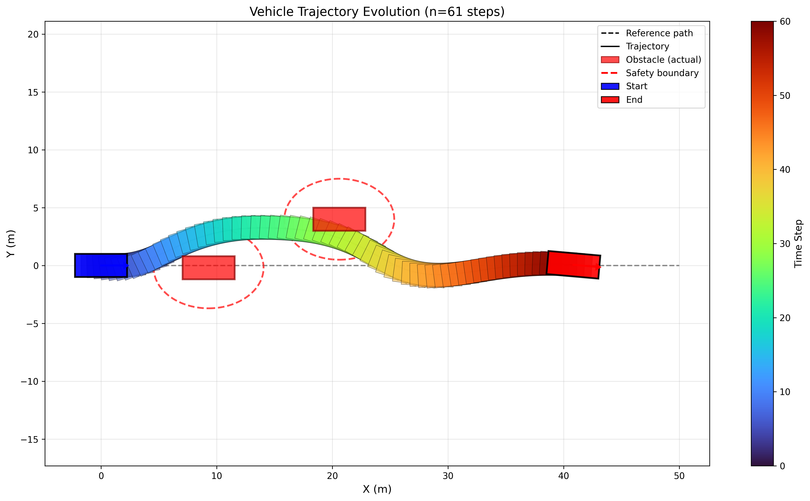

# ALM iLQR Trajectory Optimization

A Python implementation of Augmented Lagrangian Method (ALM) combined with Iterative Linear Quadratic Regulator (iLQR) for constrained trajectory optimization of autonomous vehicles.

## Demo

### Dynamic MPC Simulation


The animation shows the vehicle (blue) navigating around moving obstacles (red) using Model Predictive Control with ALM iLQR trajectory optimization.

### Single-Shot Trajectory Planning


Visualization of a single-shot trajectory planning result with static obstacles, showing the vehicle's planned path and orientation at each timestep.

## Features

- **Two-loop ALM optimization**: Outer loop enforces constraints via multiplier updates, inner loop performs iLQR optimization
- **Vehicle model**: 5D bicycle kinematic model [x, y, v, phi, yaw] with 2D control [a, omega]
- **Constraint handling**: Velocity bounds, acceleration limits, steering rate limits, and obstacle avoidance
- **Dynamic simulation**: MPC-style replanning with moving obstacles
- **Visualization**: Trajectory plots and animated GIF generation

## Installation

```bash
cd ALM_ilqr_v3
pip install numpy matplotlib
```

Requirements:
- Python 3.8+
- numpy
- matplotlib

**Note**: This is a self-contained package with no external dependencies.

## Usage

### Single-shot planning

```python
from alm_ilqr_core import ALMILQRCore
from alm_model import ALMModel

# Configure
config = {
    'wheelbase': 3.6,
    'horizon': 60,
    'dt': 0.1,
    'state_dim': 5,
    'control_dim': 2,
    # ... (see planning_main.py for full config)
}

# Initialize
model = ALMModel(config)
solver = ALMILQRCore(model, config)

# Solve
x_opt, u_opt, traj_hist, cost_hist = solver.solve(
    init_x, init_u, ref_path, obstacles
)
```

### Dynamic simulation with animation

```bash
python simulation_animation.py
```

This runs a 6-second simulation with MPC replanning and generates `simulation.gif`.

### Planning with visualization

```bash
python planning_main.py
```

## Code Style

This package follows Google Python Style Guide:
- PEP 8 compliant formatting
- Comprehensive docstrings for all modules and public methods
- Type hints for all function parameters and return values
- Organized imports: standard library → third-party → local
- Descriptive variable names (snake_case for variables, PascalCase for classes)

## File Structure

```
ALM_ilqr_v3/
├── __init__.py              # Package initialization
├── model_base.py            # Abstract base class for kinematic models
├── obstacle.py              # Obstacle class with ellipsoidal safety margins
├── alm_model.py             # ALM vehicle model implementation
├── alm_ilqr_core.py         # ALM iLQR solver implementation
├── planning_main.py         # Single-shot planning demo
├── simulation_animation.py  # Dynamic simulation with animation
├── simulation.gif           # Generated animation demo
├── vehicle_trajectory.png   # Generated trajectory visualization
└── README.md                # This file
```

## Algorithm Overview

### ALM Two-loop Structure

1. **Outer Loop** (ALM constraint enforcement):
   - Compute constraint violation
   - Update Lagrange multipliers (lambda)
   - Adjust penalty weight (mu) based on violation magnitude

2. **Inner Loop** (iLQR optimization):
   - Backward pass: Compute feedback gains via Riccati recursion
   - Forward pass: Line search with Armijo condition
   - Adaptive regularization based on acceptance

### Cost Function

```
J = Σ [ (x - x_ref)ᵀ Q (x - x_ref) + uᵀ R u ] + ALM_penalty
```

The ALM penalty term enforces constraints using augmented Lagrangian formulation.

## Configuration Parameters

| Parameter | Description | Default |
|-----------|-------------|---------|
| `horizon` | Planning horizon steps | 60 |
| `dt` | Time step [s] | 0.1 |
| `wheelbase` | Vehicle wheelbase [m] | 3.6 |
| `max_alm_iters` | Maximum outer loop iterations | 10 |
| `max_ilqr_iters` | Maximum inner loop iterations | 10 |
| `violation_tol` | Constraint violation tolerance | 1e-7 |
| `mu_gain` | Mu increase factor for large violations | 8 |

## References

- iLQR: Li, D., & Todorov, E. (2008). "Iterative linear quadratic regulator design for nonlinear biological movement systems."
- ALM: Hestenes, M. R. (1969). "Multiplier and penalty methods."
